# trojan-go搭建

## 一、简介

Trojan是近两年兴起的网络工具，项目官网https://github.com/trojan-gfw。

与强调加密和混淆的SS/SSR等工具不同，trojan将通信流量伪装成互联网上最常见的https流量，从而有效防止流量被检测和干扰。在敏感时期，基本上只有trojan和V2Ray伪装能提供稳如狗的体验。

V2Ray和Trojan有如下区别及特点：

1. v2ray是一个网络框架，功能齐全；trojan只是一个绕过防火墙的工具，轻量级、功能简单；都使用TLS加密的情况下，理论上trojan比V2ray性能更好；
2. v2ray和trojan都能实现https流量伪装；
3. v2ray内核用go语言开发，trojan是c++实现；
4. v2ray名气大，使用的人多，客户端很好用；trojan关注和使用的人少，官方客户端简陋，生态完善度不高。

## 二、准备

- 国内可连接的国外VPS一台、域名一个。

## 三、Trojan搭建

#### 3.1 解析域名

首先，为了国内操作方便，我们可以将域名托管到阿里云，或者直接在阿里云购买一个域名也可以。只是解析IP地址工信部是不会管的。具体步骤如下：

- 访问阿里云官网：https://www.aliyun.com/，完成登录后点击右上角的控制台，然后按照下例图示访问域名控制面板。

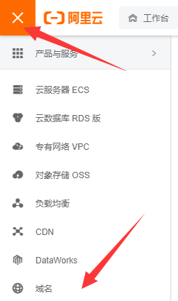

- 在弹出的页面中找到全部域名，其中就有已购买（或已托管）的域名，点击该域名操作部分的解析进入解析页面。

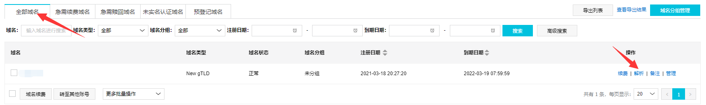

- 点击添加记录。

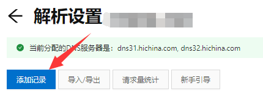

- 按照一下图示进行配置，配置完成后点击下方确认。

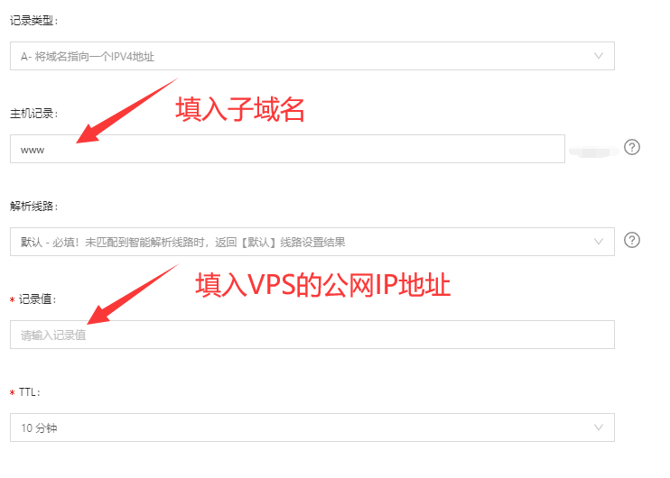

- 添加成功的记录会出现在列表中。

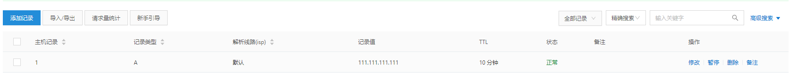

- 可以采用 `ping 域名` 的方式检测解析是否成功。

#### 3.2 配置BBR内核加速

- 使用SSH工具连接到VPS上。
- 执行一键脚本进行安装。

```bash
wget -N --no-check-certificate "https://raw.githubusercontent.com/chiakge/Linux-NetSpeed/master/tcp.sh" && chmod +x tcp.sh && ./tcp.sh
```

- 选择2安装 BBRplus版内核。

```bash
 TCP加速 一键安装管理脚本 [v1.3.2]
  -- 就是爱生活 | 94ish.me --

  0. 升级脚本
     ————————————内核管理————————————
  1. 安装 BBR/BBR魔改版内核
  2. 安装 BBRplus版内核
  3. 安装 Lotserver(锐速)内核
     ————————————加速管理————————————
  4. 使用BBR加速
  5. 使用BBR魔改版加速
  6. 使用暴力BBR魔改版加速(不支持部分系统)
  7. 使用BBRplus版加速
  8. 使用Lotserver(锐速)加速
     ————————————杂项管理————————————
  9. 卸载全部加速
  10. 系统配置优化
  11. 退出脚本
      ————————————————————————————————

 当前状态: 已安装 BBRplus 加速内核 , BBRplus启动成功

 请输入数字 [0-11]:2
```

- 中间需要重启一次，输入Y重启即可。

```bash
[注意] 重启VPS后，请重新运行脚本开启BBRplus
需要重启VPS后，才能开启BBRplus，是否现在重启 ? [Y/n] :Y
[信息] VPS 重启中...
```

- 重启后运行tcp.sh脚本，选择7使用BBRplus版加速。

```bash
 [root@localhost ~]# ./tcp.sh
 
 TCP加速 一键安装管理脚本 [v1.3.2]
  -- 就是爱生活 | 94ish.me --

  0. 升级脚本
     ————————————内核管理————————————
  1. 安装 BBR/BBR魔改版内核
  2. 安装 BBRplus版内核
  3. 安装 Lotserver(锐速)内核
     ————————————加速管理————————————
  4. 使用BBR加速
  5. 使用BBR魔改版加速
  6. 使用暴力BBR魔改版加速(不支持部分系统)
  7. 使用BBRplus版加速
  8. 使用Lotserver(锐速)加速
     ————————————杂项管理————————————
  9. 卸载全部加速
  10. 系统配置优化
  11. 退出脚本
      ————————————————————————————————

 当前状态: 已安装 BBRplus 加速内核 , BBRplus启动成功

 请输入数字 [0-11]:7
```

- 当当前状态为“已安装 BBRplus 加速内核 , BBRplus启动成功”时，即为BBR加速成功。

#### 3.3 安装Trojan

- 执行Trojan一键安装脚本。

```shell
source <(curl -sL https://git.io/trojan-install)
```

- 选择1使用Let's Encrypt证书。

```bash
1.Let's Encrypt 证书

2.自定义证书路径

请选择使用证书方式: 1
```

- 检查本机IP，并输入刚刚解析好的域名。

```bas
本机ip: 123.123.123.123
请输入申请证书的域名: www.abc.def
```

- 使用docker版的mysql存储数据。

```bash
1.安装docker版mysql(mariadb)

2.输入自定义mysql连接

请选择: 1
```

- 默认用户名和密码都使用随机即可。

```bash
生成随机用户名: VUAj, 使用直接回车, 否则输入自定义用户名: 
生成随机密码: qVMdYJwN, 使用直接回车, 否则输入自定义密码: 
新增用户成功!
```

- 在浏览器上访问解析好的域名地址，这里为https://www.abc.def/，首次访问会要求设置admin管理员密码。

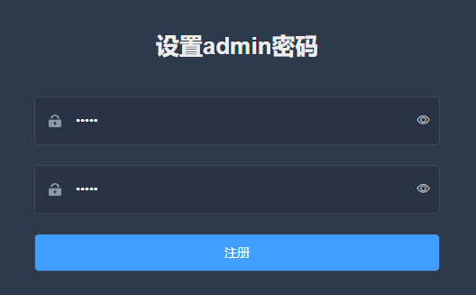

- 然后使用配置好的admin用户即可以管理员的身份登录Trojan面板。

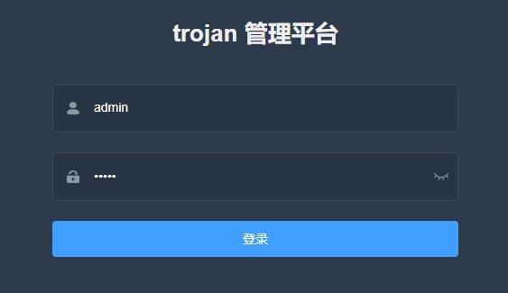

## 四、配置trojan-go与使用

#### 4.1 配置trojan-go

- 访问trojan面板，点击左侧的trojan管理。

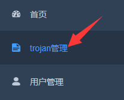

- 在类型处从默认的trojan改为trojan-go。

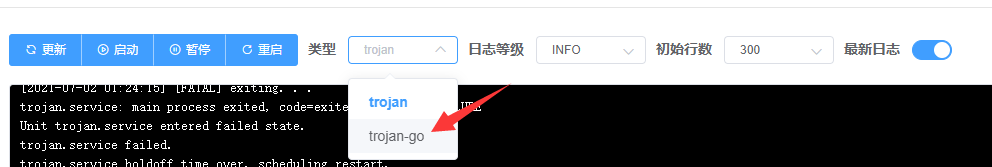

#### 4.2 添加普通用户

- 依旧在面板左侧，点击用户管理。添加上方的添加按钮，


- 输入用户名和密码，点击确定。

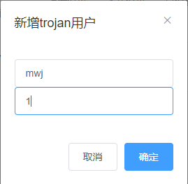

- 此时用户列表中会出现新增用户，点击右侧分享。


- 此时在弹出的窗口中有一个二维码和一个链接地址。

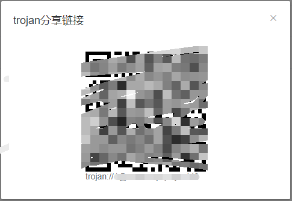

#### 4.3 在Netch中导入节点。

- 复制刚才弹窗下方的链接地址，打开Netch客户端。
- 点击服务器 >> 从剪切板导入，此时就会有一条节点导入成功。
- 服务器选择你导入成功的节点，模式建议使用"\[3] [TUN/TAP] 绕过局域网和中国大陆"。
- 点击右下角的启动，即可访问https://www.google.com/以及GitHub等你需要的网站。

